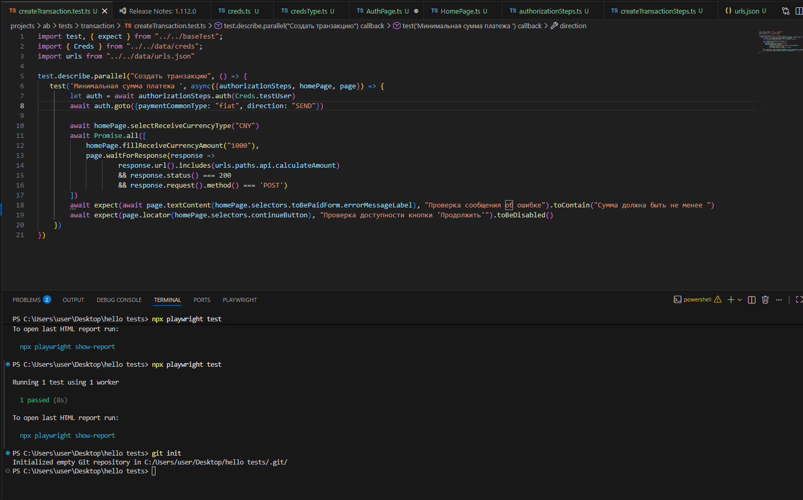

1. Установить на машину node.js версией 12 и выше
2. Установить пакеты npm i
3. Запуск тестов npx playwright test --workers 1
4. Просмотр отчета о прохождении тестов npx playwright show-report

Необходимо создать в корне файл .env и зполнить поля для хранения конф.данных, либо заполнить переменные в системе контроля версий: LOGIN, PASSWORD, CODE

Папка проекты содержит проект ab - ab payments
ab:
    - data - данные, необходимые для заполнения
    - pages - объекты для работы со страницей
    - steps - шаги, для прохождения бизнес-процесса по порядку
    - tests - тесты
    - types - описание типов объекта
    - baseTest - фикстуры

Результат тестов:
